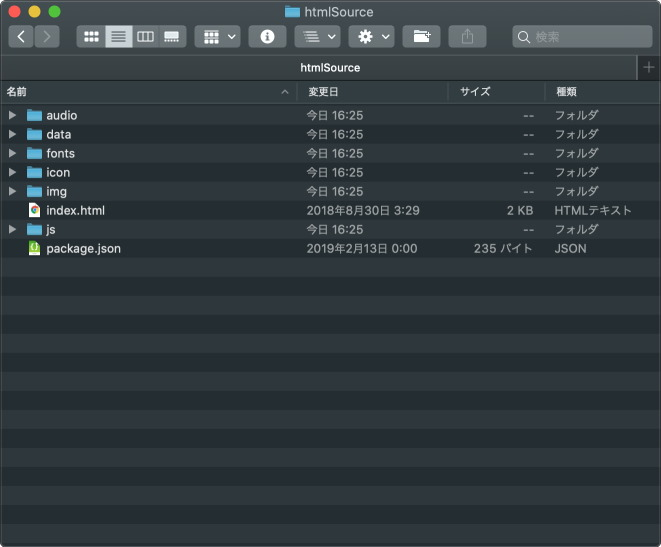
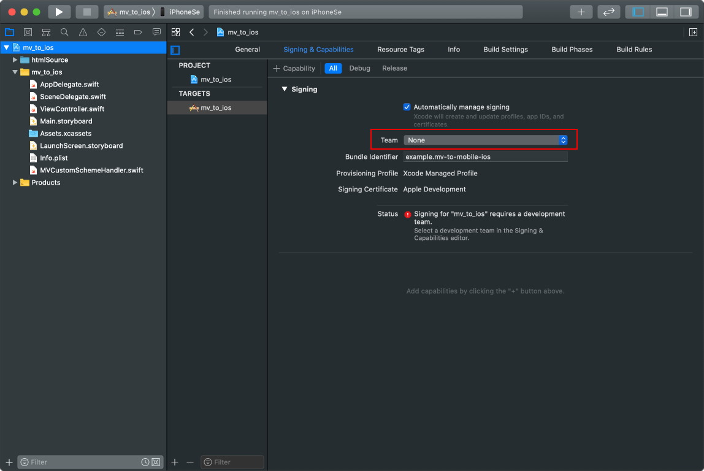
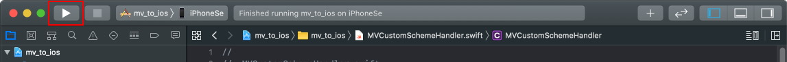

# mv_to_ios

## 概要
* RPGツクールMV/RPGツクールMZで作成されたプロジェクトをiOSアプリ化するためのXcode プロジェクトです。
* プラグインは不要、RPGツクールMV(MZ)でデプロイメントしたファイルを所定の場所に配置するだけです。
* iOS側でWKWebViewを表示し、RPGツクールMV(MZ)で出力されたhtml/javascriptを読み込みます。
* ローカル(`file://`)で実行される `XMLHttpRequest`等のCORSを回避するために、[WKURLSchemeHandler](https://developer.apple.com/documentation/webkit/wkurlschemehandler)を使用しています。

## 必要なもの

* [RPGツクールMV](https://tkool.jp/mv/)(または、[RPGツクールMZ](https://tkool.jp/mz/))
* [Xcode](https://apps.apple.com/jp/app/xcode/id497799835?mt=12)
* iOS13以上

## 動作確認

- RPGツクールMV
  - Xcode 11.5
  - RPGツクールMV 1.6.2
  - iOS 13.5.1
- RPGツクールMZ
  - Xcode 11.6
  - RPGツクールMZ 1.0.1
  - iOS 13.5.1

## 使い方

1. githubよりCloneもしくは[zipをダウンロード](https://github.com/waffs702/mv_to_ios/archive/master.zip)します。

2. ダウンロードした場合は、zipを解凍します。

3. RPGツクールMVプロジェクトをAndroid/iOS用にデプロイメントします。

​	RPGツクールMZの場合は、ウェブブラウザようにデプロイメントします。

​	

4. デプロイメントされたwwwフォルダ配下のファイルを、mv_to_iosの`htmlSource`フォルダ配下に配置します。

5. Xcodeを起動します。

6. 左側ツリーから、`mv_to_ios` をクリック、TARGETSの`mv_to_ios` をクリック、`Signing & Capabilities` をクリック、TeamがNoneとなっているので適切なDeveloper Accountを選択します。（Apple Developer Programへの登録が必要です。/iOSシミュレータで実行する場合はこの操作は不要です。）

7. PCにiOS端末を接続し、`再生ボタン`アイコンをクリックすると、iOSにアプリがインストールされデバッグモードで起動します。

## 今後追加予定の機能

- バナー広告、動画広告
- push通知(Firebase)
- アプリ内課金
- Twitter画面スクリーンショットシェア

## License
MIT